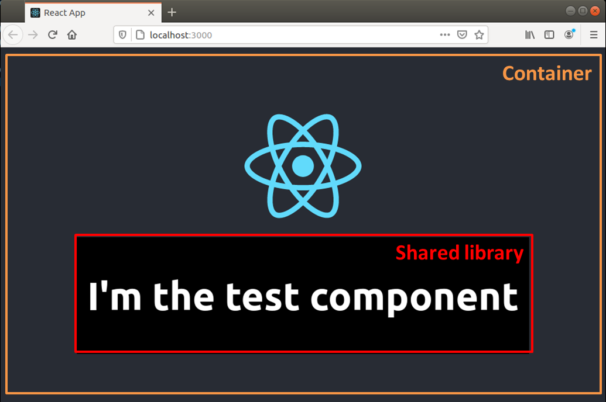

# Sharing Components - using Component Library

```
root
├── container  # React Application that consumes library
└── library    # React Custom Reusable Component Library
```

## Overview

### Main App (Container)



### Storybook (Documentation + Playground)


## Usage

- **To view library itself**
    - `cd library`
    - `yarn run storybook` --> platform to view components in library

- **To view library inside a React App**
    1. Build the library
        - `cd library` --> React Component Library
        - `yarn install`
        - `yarn run build`
    
    2. Start the web app
        - `cd container` --> React App
        - `yarn install`
        - `yarn start`
