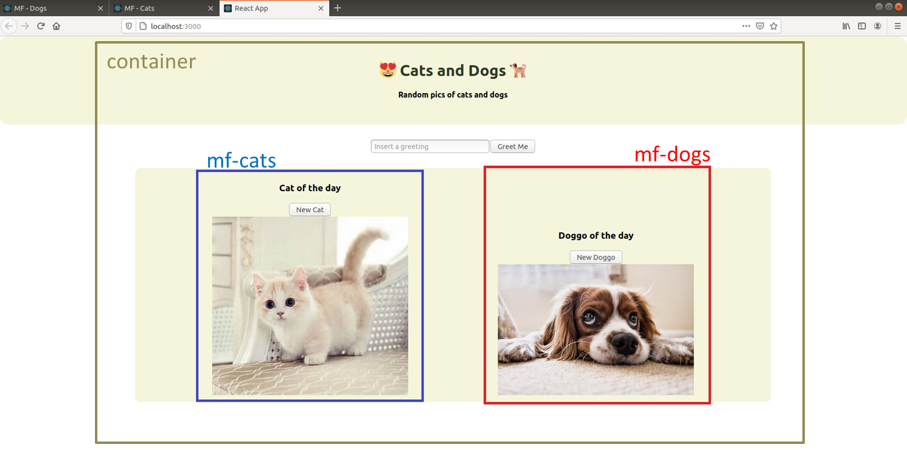

# Micro Frontend - using Cam Jackson Micro Frontend Framework

```
root
├── container  # React Application that consumes the Micro-Fontends
├── content    # Static shared resources
├── mf-cats    # React Micro-Frontend 1 
└── mf-dogs    # React Micro-Frontend 2
```



## Usage

1. Start the content server **[Important]**
    - `cd content`
    - `yarn install`
    - `yarn start`

2. Start the Dogs Micro Frontend
    - `cd mf-dogs`
    - `yarn install`
    - `yarn start`

3. Start the Cats Micro Frontend
    - `cd mf-cats`
    - `yarn install`
    - `yarn start`

4. Start the Container App
    - `cd container`
    - `yarn install`
    - `yarn start`
    