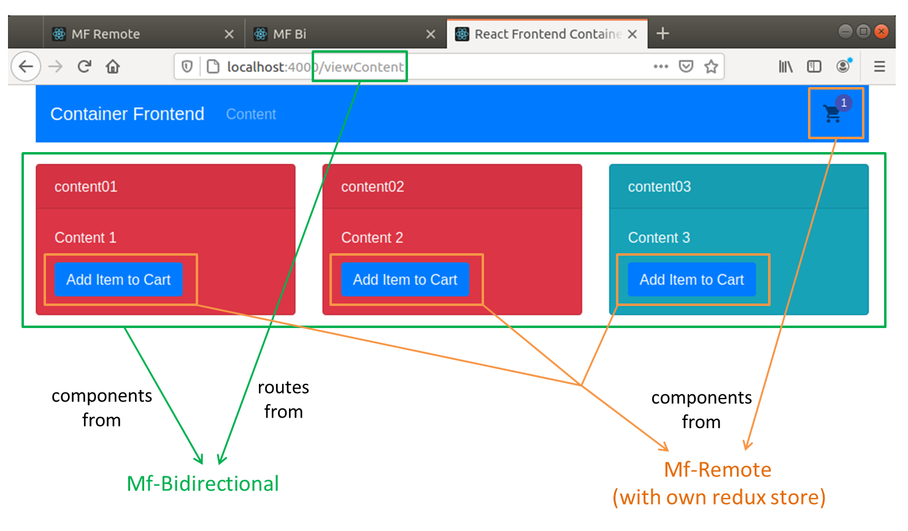

# Micro Frontend - using Webpack Module Federation

```
root
├── dynamic  # Workaround to keep container app alive even when MFE is dead
└── static   # Basic Module Federation implementation
```

## Overview

There is currently no best practises for implementing Micro Frontend. Refer to
- [static folder](static) on how to implement basic module federation.
- [dynamic folder](dynamic) on the workaround I tried to keep the main app (container) alive even when the MFE are dead.

### Additional Context Note



- **container** -- consumes remote components from both `mf-bidirection` and `mf-remote`
    - **routing** -- demonstrates how to merge routing config from remote micro frontend.
    - **state-management** -- demonstrates how to merge redux states from remote micro frontend using 
    [reducer injection approach](https://redux.js.org/recipes/code-splitting#reducer-injection-approaches)
- **mf-bidirectional** -- provides remote components for `container` and consumes components from `mf-remote`
    - **routing** -- has its own routes. Implemented `react-router-dom` to demonstrate how to expose routing to consumer.
    - **state-management** -- **no stage management implemented**, simply consumes `mf-remote` that has state-management.
- **mf-remote** -- provides remote components for `container` and `mf-remote`
    - **state-management** -- has its own state management. Implemented `redux` to demonstrate how to use redux.

## Findings & Implementations 

### 1. Loading components/functions dynamically without app crashing

**Aim:** The goal is to demonstrate how to keep web applications alive even when one of the micro frontend (MFE) is dead. 

In order to use components/functions from MFE, we will have to make sure that the "container app" is able to access the
exposed components/functions from the MFE. This is done via `<script src="localhost:3001/remoteEntry.js></script>` in 
container app's`index.html`. However, container app will crash if this script is not available at run time. To overcome
this, the creator of module federation provided an [example](https://github.com/module-federation/module-federation-examples/blob/master/advanced-api/dynamic-remotes/app1/src/App.js).
However, there were some limitations where script will constantly be loaded and unloaded whenever container app uses a
component/function from MFE. Hence, using the same principal, I implemented the following:

1. When container app loads, it will load the `remoteEntry.js` script.
2. When the respective MFE's remoteEntry.js script is loaded, it will push an event to update a "variable" in the `sessionStorage`.
3. Components / Functions will `listen` for the "variable" and only `loads dynamically` when remoteEntry.js script is loaded.
    - Remote Components -- load via `React.lazy` & `React.Suspense`
    - Remote Functions -- load via `custom hooks` & `Promises`
    - Refer to [mf-react-util](dynamic/container/src/utils/mf-react-util.tsx) for more details...

### 2. SessionStorage

As mentioned in point 1, I am using `sessionStorage` as a way to keep track of whether `remoteEntry.js` of respective MFE`
have been loaded. 

- This might not be the best implementation. **[Might have to explore better alternatives]**
- Reason for using this is because using `sessionStorage` was less complex than using `React.Context` and `Redux` which
were hard to implement as we are loading remoteEntry.js dynamically...

### 3. Typescript

There are some difficulties making full use of types when importing remote components...

### 4. State Management with Redux

It might be best to implement isolated state management where each MFE have its own store.
