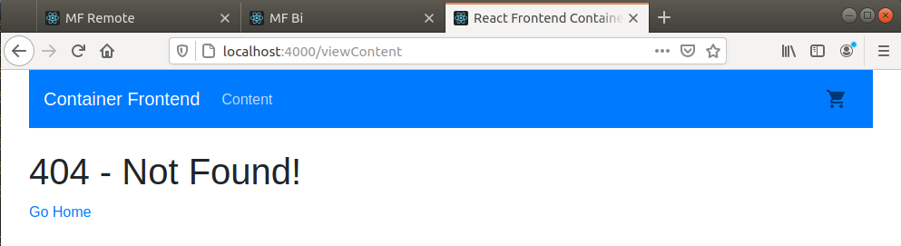
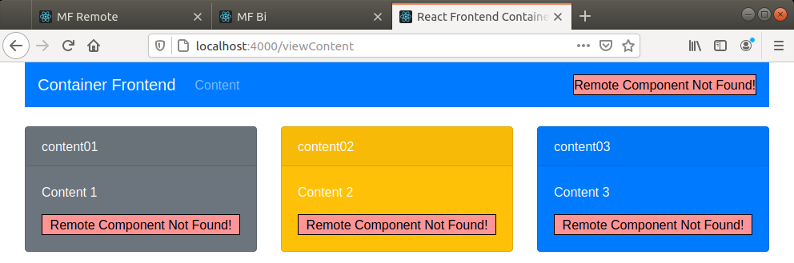

# Micro Frontend - using Webpack Module Federation (Dynamic Loading)

```
root
├── container                # React Application that consumes the Micro-Fontends
├── mf-bidirectional         # React Micro-Frontend 1 (Host + Remote)
└── mf-remote                # React Micro-Frontend 2 (Remote)
```

## Usage

- **Test `mf-bidirectional` as a host**
    - Things you can try:
        - stop `mf-remote` and you will notice that `mf-bidirectional` will crash. This is because `mf-bidirectional`
        is not fully dynamic as a host...
         
    - Start all the apps
        1. Start the remote app
            - `cd mf-remote`
            - `yarn install`
            - `yarn start`
        
        2. Start the Host/Remote app **[Will NOT work without `mf-remote` running]**
            - `cd mf-bidirectional`
            - `yarn install`
            - `yarn start`
        
- **Test the Main App (Dynamic Loading + Redux + Routing)**
    - Things you can try:
        - stop `mf-remote` or `mf-bidirectional` or both MFE. **`container` app should still be alive.** This is because
        components exposed by `mf-remote` is loaded dynamically by both `container` and `mf-bidirectional` (This applies
        for components exposed by `mf-bidirectional` which `container` consumes).
    
    - Start all the apps
        1. Start the remote app
            - `cd mf-remote`
            - `yarn install`
            - `yarn start`
        
        2. Start the Host/Remote app **[works even without `mf-remote` running]**
            - `cd mf-bidirectional`
            - `yarn install`
            - `yarn start`
        
        3. Start the Container app
            - `cd container`
            - `yarn install`
            - `yarn start`
    
    - Preview:
        - `mf-bidirectional` dead
       
            
        
        - `mf-remote` dead
    
            
            